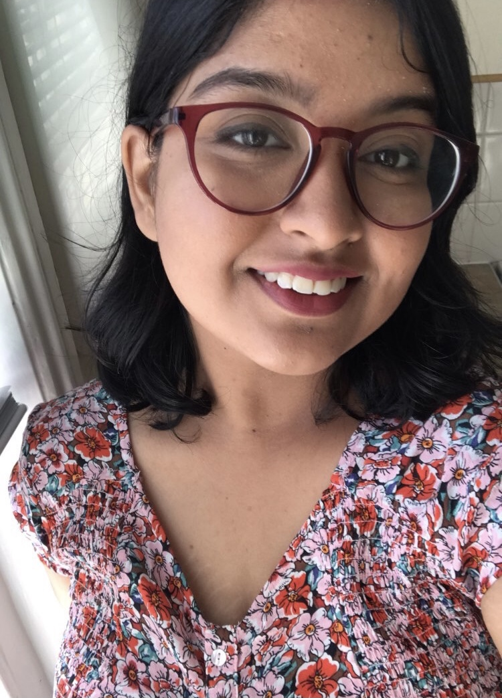

Hello, my name is Additi Pandey and I like exploring things that are "merely real". My interests are in Cognitive Neuroscience, Machine Learning, Functional Programming, Number Theory and Etymology. My MSc thesis was titled "Reciprocity Laws" that dealt with the quadratic and the cubic reciprocity laws, and primes of the form $x^2+ny^2$.

I am pursuing my master's in Pure Mathematics from Imperial College London and I did my bachelor's in Mathematics from Jesus and Mary College, University of Delhi. I also attended a graduate summer school at Tata Institute of Fundamental Research.

This webpage contains my resume, link to my blog and projects which I worked upon to explore my interests in the aforementioned fields. If you are interested in these topics as well, <a href="https://cyclotomicextension.blogspot.com/">visit my blog!</a>

